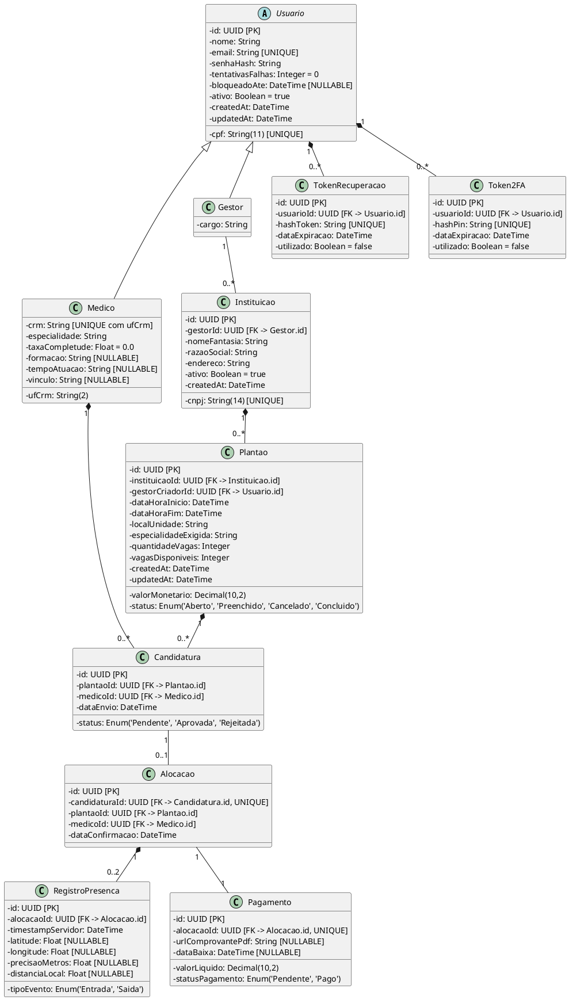

# Diretrizes de Implementação do Back-end — Alocca Plantões
> **Guia Técnico e Especificação para Agentes Autônomos de Código**
> 
> Este documento centraliza todas as especificações arquiteturais, requisitos, modelo de dados, regras de negócio (RN), mensageria (MSG) e endpoints dos casos de uso (UC01 ao UC12) do projeto **Alocca Plantões**. Qualquer implementação no repositório de back-end deve seguir estritamente as diretrizes contidas neste arquivo.

---

## 1. Visão Geral e Arquitetura do Sistema

### 1.1 Objetivo
O **Alocca Plantões** é uma plataforma desenvolvida para digitalizar e formalizar a gestão de escalas médicas hospitalares, substituindo a comunicação manual e descentralizada conduzida por grupos informais (WhatsApp) por um ambiente estruturado, seguro, auditável e em conformidade com a LGPD e os Objetivos de Desenvolvimento Sustentável da ONU (ODS 3 e ODS 8).

### 1.2 Modelo Arquitetural: Hub / Marketplace Descentralizado
* **Gestor Hospitalar:** Opera como administrador com conta unificada capaz de gerenciar múltiplas unidades/instituições (CNPJs de hospitais, clínicas e cooperativas). Ao cadastrar uma vaga, o gestor define obrigatoriamente a autoria institucional.
* **Médico:** Atua como profissional livre na plataforma. Possui acesso a um feed global de vagas abertas de todas as instituições parceiras, sem necessidade de aprovação prévia em uma instituição específica. O vínculo formal entre médico e instituição é estritamente transacional, nascendo no momento da aprovação da candidatura (`AlocacaoDePlantao`) e extinguindo-se após o pagamento.
* **Comunicação Front-end / Back-end:** API RESTful consumida pelo aplicativo mobile nativo desenvolvido em **Kotlin**. Todas as respostas devem ser em formato JSON padronizado.

---

## 2. Instruções Diretas para o Agente de IA (Coding Agent)

Ao desenvolver endpoints, entidades, migrações e serviços neste repositório:
1. **Siga a Arquitetura em Camadas (Clean Architecture / Layered):**
   - `Controllers / Routes`: Validação de esquema de entrada (DTOs), controle de rotas e códigos HTTP.
   - `Services / Use Cases`: Aplicação rígida de todas as Regras de Negócio (RNs).
   - `Repositories / DAOs`: Acesso a dados e consultas transacionais atômicas.
   - `Entities / Models`: Mapeamento das tabelas do banco de dados relacional.
2. **Atomicidade e Concorrência:**
   - A alocação de médico (`UC11`) deve rodar em uma **transação de banco de dados**: decrementar vagas, verificar teto, transitar status para `Preenchido` se esgotado, alterar status da candidatura vencedora para `Aprovada`, alterar as demais para `Rejeitada` e enfileirar notificações.
   - A candidatura do médico (`UC05`) deve checar conflito de horários (**Double-booking**) contra a tabela de `Alocacao` com bloqueio contra condições de corrida.
3. **Segurança e Criptografia:**
   - Senhas devem ser armazenadas exclusivamente com algoritmo de hash irreversível forte (`bcrypt` com salt ou `Argon2`).
   - Rate limiting no login: bloquear a conta por 15 minutos após 5 erros consecutivos de senha.
   - Obfuscação na recuperação de senha: se o e-mail não existir, retornar mensagem genérica de sucesso para evitar enumeração de contas.
4. **LGPD e Privacidade:**
   - O registro de presença (check-in/check-out) é pontual sob ação explícita. Nunca implementar rotinas de rastreamento contínuo em background.
   - Se o cliente não enviar coordenadas de GPS (permissão negada), gravar `latitude = null` e `longitude = null`, validando o registro apenas pelo `timestampServidor`.

---

## 3. Modelo de Entidades e Banco de Dados Relacional



> **Restrições:** `UNIQUE(candidatura.plantaoId, candidatura.medicoId)` (sem candidatura duplicada); `UNIQUE(medico.crm, medico.ufCrm)`; PIN e token de recuperação armazenados só como hash, nunca em texto puro. **Pendente:** tipo das coordenadas (`Decimal(10,8)` vs `Float`) e nome do campo de distância (`distanciaMetros` vs `distanciaLocal`).

---

## 4. Catálogo Oficial de Regras de Negócio (RN01 a RN31)

| Código | Nome da Regra | Descrição e Validação Técnica no Back-end |
| :--- | :--- | :--- |
| **RN01** | Unicidade de E-mail | `email` único em `usuarios`; normalizar com `trim().toLowerCase()` antes de persistir. |
| **RN02** | Validação de CPF | `cpf` único e válido pelo dígito verificador (módulo 11); armazenar só os 11 dígitos numéricos. |
| **RN03** | Unicidade de CRM e UF | A combinação `(crm, ufCrm)` deve ser exclusiva por médico. |
| **RN04** | Higienização de Entradas | Remover pontuação de CPF e aplicar `trim()` em todos os campos de texto. |
| **RN05** | Padrão de Senha | Mínimo 8 caracteres com maiúscula, minúscula e número (`^(?=.*[a-z])(?=.*[A-Z])(?=.*\d).{8,}$`). |
| **RN06** | Autenticação por Papel | Médico e gestor usam fluxos e rotas separados (`/auth/login/medico`, `/auth/login/gestor`) com permissões por rota. |
| **RN07** | Flexibilidade de Identificador | Médico: E-mail, CPF (com/sem pontuação) ou CRM — detectar o formato e consultar a coluna correta. Gestor: E-mail corporativo ou CPF (sem CRM). |
| **RN08** | Rate Limiting no Login | 5 falhas consecutivas → `bloqueadoAte = now() + 15 min`; responder `429`. |
| **RN09** | Desafio 2FA | Credenciais válidas geram `challengeToken` temporário (biometria no app). |
| **RN10** | Fallback 2FA via PIN | PIN numérico de 6 dígitos com validade de 5 minutos, enviado ao e-mail do usuário. |
| **RN11** | Validade de Token de Recuperação | Expira em 15 minutos e é invalidado no primeiro uso. |
| **RN12** | Obfuscação na Recuperação | E-mail inexistente → mesmo `200 OK` genérico (anti-enumeração de contas). |
| **RN13** | Visibilidade do Feed Global | Feed lista plantões com `status = 'Aberto'` **e** `vagasDisponiveis > 0`; global multi-instituição. |
| **RN14** | Vínculo Transacional | Vínculo médico↔instituição só existe via `Alocacao`. |
| **RN15** | Filtros de Descoberta | Feed filtra por `especialidade`, `localizacao` (cidade/UF) e faixa de `valor` (expansível depois). |
| **RN16** | Prevenção de Double-Booking | Rejeita candidatura (`409`) se o médico tem `Alocacao` com intervalo sobreposto. Só um booking por horário. |
| **RN17** | Completude de Perfil | Pesos: Especialidade 40%, Formação 20%, Vínculo 20%, Tempo de atuação 20%. Sem Especialidade, não aplica para vagas específicas. Sem distinção de UTI — só plantões diretos. |
| **RN18** | Acesso a Comprovantes | Médico só baixa o comprovante se `statusPagamento = 'Pago'`. |
| **RN19** | Check-in Pontual (LGPD) | Toque explícito, sem tracking em background. GPS negado → `latitude/longitude = null`, valida só pelo `timestampServidor`. |
| **RN20** | Múltiplas Vagas por Plantão | `quantidadeVagas >= 1`; vira `Preenchido` quando `vagasDisponiveis == 0`. |
| **RN21** | Alocação Exclusiva e Rejeição em Cascata | Na última vaga: `Preenchido`, rejeita concorrentes restantes e notifica todos. |
| **RN22** | Baixa com Comprovante | Ir para `'Pago'` exige anexo válido (PDF/JPG/PNG). Sem gateway bancário no MVP. |
| **RN23** | Vínculo Institucional Obrigatório | Todo plantão tem `instituicaoId` válido administrado pelo gestor autenticado. |
| **RN24** | Campos Operacionais Obrigatórios | `dataHoraInicio`, `dataHoraFim`, `localUnidade`, `especialidadeExigida`, `valorMonetario`, `quantidadeVagas` e `instituicaoId`. |
| **RN25** | Coerência Temporal | Rejeita vaga com `dataHoraFim <= dataHoraInicio`. |
| **RN26** | Status Inicial do Plantão | Recém-criado nasce `'Aberto'`. |
| **RN27** | Imutabilidade após Candidaturas | Com candidaturas ativas, não altera datas/horários/valores (só cancelamento). |
| **RN28** | Elegibilidade para Pagamento | Só entra em baixa após `now() >= dataHoraFim`. |
| **RN29** | Upload Seguro | Extensão validada, máximo 5MB, nome com UUID, storage no SeaweedFS. |
| **RN30** | Validação Institucional | Vínculo de instituição exige CNPJ válido e ativo, com ramo de saúde. |
| **RN31** | Temporizador de Convites Diretos | Convite direto expira sem resposta → `Expirado/Recusado`. |

---

## 5. Tabela de Mensageria Padronizada (MSG)

| Código | Mensagem Oficial | HTTP Status | Aplicação |
| :--- | :--- | :---: | :--- |
| **MSG-01** | E-mail, CPF, CRM ou senha incorretos. | `401 Unauthorized` | Falha de autenticação no login. |
| **MSG-02** | Este dado (E-mail/CPF/CRM) já pertence a uma conta ativa. | `409 Conflict` | Tentativa de cadastro com dados duplicados. |
| **MSG-03** | Conta bloqueada temporariamente. Tente novamente em 15 minutos. | `429 Too Many Requests` | Bloqueio por rate limiting (5 erros). |
| **MSG-04** | Biometria não reconhecida. Insira o PIN enviado ao seu e-mail. | `200 OK` | Fallback para envio do PIN de 2FA. |
| **MSG-05** | Se o e-mail constar em nossa base, um link de redefinição será enviado. | `200 OK` | Resposta obfusca da recuperação de senha. |
| **MSG-06** | Link de redefinição inválido ou expirado. | `400 Bad Request` | Validação de token com > 15 min ou já usado. |
| **MSG-07** | Cadastro realizado com sucesso! | `201 Created` | Criação de conta do médico. |
| **MSG-08** | Senha atualizada com sucesso! | `200 OK` | Confirmação de redefinição de senha. |
| **MSG-09** | Candidatura enviada com sucesso! Acompanhe o status na sua agenda. | `201 Created` | Candidatura aceita no feed. |
| **MSG-10** | Conflito de agenda: você já possui um plantão confirmado neste horário. | `409 Conflict` | Bloqueio de double-booking. |
| **MSG-11** | Check-in registrado com sucesso. Bom plantão! | `201 Created` | Presença validada com GPS. |
| **MSG-12** | Check-in registrado sem localização (GPS negado). | `201 Created` | Presença validada sem GPS (LGPD). |
| **MSG-13** | Perfil atualizado. Sua taxa de completude subiu! | `200 OK` | Atualização de dados cadastrais. |
| **MSG-14** | Plantão publicado com sucesso! A vaga já está visível para os médicos. | `201 Created` | Publicação de vaga pelo gestor. |
| **MSG-15** | Preencha todos os campos obrigatórios para publicar a vaga. | `400 Bad Request` | Falha de validação no formulário do plantão. |
| **MSG-16** | A data e hora de fim não podem ser anteriores à data e hora de início. | `400 Bad Request` | Erro de coerência temporal. |
| **MSG-17** | Médico alocado com sucesso! Os demais candidatos foram notificados. | `200 OK` | Aprovação de candidatura e fechamento da vaga. |
| **MSG-18** | Comprovante anexado e status financeiro atualizado para "Pago". | `200 OK` | Baixa financeira pelo gestor com arquivo anexado. |

---

## 6. Especificação dos Casos de Uso (UC01 ao UC12) & Endpoints REST

### UC01 — Cadastro de Médico
- **Endpoint:** `POST /api/v1/auth/medicos/registro`
- **Atores:** Médico (Não autenticado).
- **Request Body (DTO):**
  ```json
  {
    "nome": "Dr. Lucas Silva",
    "cpf": "12345678901",
    "crm": "123456",
    "ufCrm": "DF",
    "especialidade": "Clínica Médica",
    "email": "lucas.silva@medico.com",
    "senha": "SenhaSegura123"
  }
  ```
- **Regras:** RN01, RN02, RN03, RN04, RN05.
- **Respostas:** `201 Created` (MSG-07) ou `409 Conflict` (MSG-02).

### UC02 — Realizar Login e Autenticação 2FA (Médico)
- **Endpoint:** `POST /api/v1/auth/login/medico`
- **Request Body:**
  ```json
  {
    "identificador": "12345678901", // email, cpf ou crm
    "senha": "SenhaSegura123"
  }
  ```
- **Lógica:** Valida credenciais; se errar incrementa `tentativasFalhas`; se >= 5, aplica RN08 (MSG-03). Se sucesso, retorna desafio de 2FA:
  ```json
  {
    "challengeToken": "uuid-temp-token",
    "requer2FA": true
  }
  ```
- **Fallback 2FA (PIN):** `POST /api/v1/auth/2fa/solicitar-pin` e `POST /api/v1/auth/2fa/validar-pin` com `pinCode` de 6 dígitos (campo da requisição; no banco grava só o hash, RN10).

### UC03 — Realizar Login e Autenticação 2FA (Gestor)
- **Endpoint:** `POST /api/v1/auth/login/gestor`
- **Request Body:** `identificador` (E-mail corporativo ou CPF) e `senha`.
- **Regras:** RN07, RN08.

### UC04 — Recuperação de Senha
- **Solicitar Token:** `POST /api/v1/auth/recuperar-senha`
  - Body: `{"email": "usuario@exemplo.com"}`
  - Regra: RN11, RN12. Sempre retorna `200 OK` (MSG-05).
- **Redefinir Senha:** `POST /api/v1/auth/redefinir-senha`
  - Body: `{"token": "hash-token", "novaSenha": "NovaSenhaForte123"}`
  - Regra: RN05, RN11. Retorna `200 OK` (MSG-08) ou `400 Bad Request` (MSG-06).

### UC05 — Buscar e Candidatar-se a Plantão
- **Listar Vagas (Feed):** `GET /api/v1/plantoes?status=Aberto&especialidade=Pediatria&cidade=Brasilia`
  - Regras: RN13, RN15.
- **Candidatar-se:** `POST /api/v1/plantoes/{idPlantao}/candidaturas`
  - Header: `Authorization: Bearer <jwt-medico>`
  - Regras: RN16 (verifica double-booking em alocações confirmadas), RN17 (verifica completude de perfil).
  - Respostas: `201 Created` (MSG-09) ou `409 Conflict` (MSG-10).

### UC06 — Realizar Check-in e Check-out
- **Endpoint:** `POST /api/v1/presenca`
  - Header: `Authorization: Bearer <jwt-medico>`
  - Request Body:
    ```json
    {
      "alocacaoId": "uuid-alocacao",
      "tipoEvento": "Entrada", // ou "Saida"
      "latitude": -15.7942,    // null se recusado
      "longitude": -47.8822,   // null se recusado
      "precisaoMetros": 12.5   // null se recusado
    }
    ```
  - Regra: RN19. Se GPS for null, salva apenas com o timestamp do servidor (MSG-12); se com GPS, calcula distância (MSG-11).

### UC07 — Gerenciar Conta e Perfil
- **Obter Perfil:** `GET /api/v1/perfil/medico`
- **Atualizar Perfil:** `PUT /api/v1/perfil/medico`
  - Body: `{"especialidade": "Cardiologia", "formacao": "UnB", "tempoAtuacao": "5 anos", "vinculo": "Autônomo"}`
  - Regra: RN17 (recalcula dinamicamente a `taxaCompletude`). Retorna MSG-13.

### UC08 — Visualizar Dashboard Financeiro (Médico)
- **Consultar Saldos:** `GET /api/v1/financeiro/medico`
  - Retorna resumo: `totalRecebido`, `totalAReceber`, `totalPendente` e a lista detalhada com status.
- **Download do Comprovante:** `GET /api/v1/financeiro/comprovantes/{idPagamento}`
  - Retorna o stream do arquivo PDF/imagem (só se `statusPagamento = 'Pago'`, RN18).

### UC09 — Gerenciar Agenda (Calendário)
- **Endpoint:** `GET /api/v1/agenda/mes?ano=2026&mes=10`
  - Retorna array de plantões do médico logado agrupados por dia, com indicadores de status (`Confirmado`, `Pendente`, `Concluído`).

### UC10 — Criar e Publicar Plantão (Gestor)
- **Listar Instituições do Gestor:** `GET /api/v1/instituicoes/vinculadas`
- **Publicar Plantão:** `POST /api/v1/plantoes`
  - Header: `Authorization: Bearer <jwt-gestor>`
  - Request Body:
    ```json
    {
      "instituicaoId": "uuid-instituicao",
      "dataHoraInicio": "2026-10-15T07:00:00Z",
      "dataHoraFim": "2026-10-15T19:00:00Z",
      "localUnidade": "Hospital Regional Norte - UTI Adulto",
      "especialidadeExigida": "Medicina Intensiva",
      "valorMonetario": 1800.00,
      "quantidadeVagas": 2
    }
    ```
  - Regras: RN20, RN23, RN24 (MSG-15), RN25 (MSG-16), RN26 (MSG-14).

### UC11 — Avaliar Candidaturas e Alocar Médico (Gestor)
- **Listar Candidatos:** `GET /api/v1/plantoes/{idPlantao}/candidaturas`
- **Aprovar Candidato:** `POST /api/v1/plantoes/{idPlantao}/candidaturas/{idCandidatura}/aprovar`
  - **Lógica Transacional Crítica:**
    1. Registra nova linha em `Alocacao` (`candidaturaId`, `plantaoId`, `medicoId`).
    2. Altera status da candidatura para `'Aprovada'`.
    3. Cria registro inicial de `Pagamento` com status `'Pendente'`.
    4. Subtrai 1 vaga das vagas remanescentes.
    5. Se vagas restantes == 0:
       - Altera status do plantão para `'Preenchido'`.
       - Rejeita em lote as demais candidaturas daquela vaga (`status = 'Rejeitada'`).
       - Enfileira eventos de notificação (Push/E-mail) para os médicos rejeitados e para o aprovado.
  - Regras: RN20, RN21 (MSG-17).

### UC12 — Registrar Pagamento e Anexar Comprovante (Gestor)
- **Listar Plantões Elegíveis para Baixa:** `GET /api/v1/financeiro/pendentes-baixa`
  - Filtra plantões com `now() >= dataHoraFim` e pagamento `'Pendente'`.
- **Efetivar Pagamento:** `POST /api/v1/financeiro/pagamentos/{idPagamento}/dar-baixa`
  - Form-Data: `comprovante` (arquivo PDF, JPG ou PNG, max 5MB).
  - Lógica: Faz upload seguro do arquivo para o SeaweedFS, grava `urlComprovantePdf`, `dataBaixa = now()`, altera `statusPagamento = 'Pago'`.
  - Regras: RN22, RN28, RN29 (MSG-18).

---

## 7. Requisitos Não Funcionais Críticos (RNF)

- **RNF01 (Stack & Rest):** Back-end arquitetado com princípios RESTful em JSON, autenticação Stateless via JWT e suporte de headers CORS.
- **RNF02 (LGPD):** Nenhum registro de localização deve ser armazenado sem autorização pontual. Campo de coordenadas nulo como padrão de proteção.
- **RNF03 (Rate Limiting):** Proteger endpoints de autenticação (`/api/v1/auth/*`) com limitação de taxa (máximo de 5 falhas antes do bloqueio de 15 minutos).
- **RNF04 (Persistência & Armazenamento):** Banco de dados relacional com integridade referencial por foreign keys. Armazenamento de arquivos de comprovantes com nomes aleatórios (UUIDs) para impedir acesso não autorizado por enumeração de URLs.
- **RNF05 (Gerenciamento de Sessão):** Suporte a Refresh Tokens de longa duração para permitir autenticação biométrica rápida diária sem redigitação de senhas.

---

## 8. Roteiro Passo a Passo para o Agente de Código

Para garantir entrega incremental e testável, o agente deve implementar os módulos na seguinte ordem:

1. **Fase 1 — Infraestrutura & Migrações:**
   - Configurar o banco relacional e criar as migrações para todas as tabelas descritas na Seção 3.
   - Criar índices para chaves únicas (`email`, `cpf`, `crm + ufCrm`, `cnpj`).
2. **Fase 2 — Módulo de Autenticação & Usuários (UC01 a UC04):**
   - Implementar DTOs com validações de regex (CPF, senha, email).
   - Implementar serviço de hash de senhas, lógica de Rate Limit e emissão de JWT.
   - Implementar fluxo de recuperação de senha com obfuscação.
3. **Fase 3 — Módulo de Instituições & Vagas (UC10):**
   - Endpoints de listagem de instituições do gestor e cadastro de plantões.
   - Validações de data de início/fim e quantidade de vagas.
4. **Fase 4 — Feed, Candidatura & Alocação (UC05 e UC11):**
   - Query otimizada do feed global com filtros.
   - Regra de Double-Booking e transação atômica de aprovação de alocação com rejeição em cascata.
5. **Fase 5 — Presença, Perfil & Financeiro (UC06, UC07, UC08 e UC12):**
   - Endpoint de check-in/out compatível com LGPD (coordenadas nulas).
   - Cálculo dinâmico de completude do perfil.
   - Módulo de upload de comprovantes (multipart/form-data) e fechamento financeiro.
6. **Fase 6 — Testes Automatizados:**
   - Testes unitários para regras de validação (CPF, padrão de senha, cálculo de completude de perfil).
   - Testes de integração para os cenários críticos: conflito de agenda (Double-booking) e transação atômica de alocação de plantão.

---

## 9. Convenções de Código

* **Nomenclatura:** português consistente com o domínio (`plantao`, `candidatura`, `alocacao`, `crm`).
* **Erros:** exception filter centralizado retornando o padrão MSG-XX do spec.
* **Env:** nenhum segredo hardcodado (`.env`, chaves JWT, credenciais).
* **Logs:** estruturados com timestamp para login falho, aprovação de alocação e baixa financeira.
